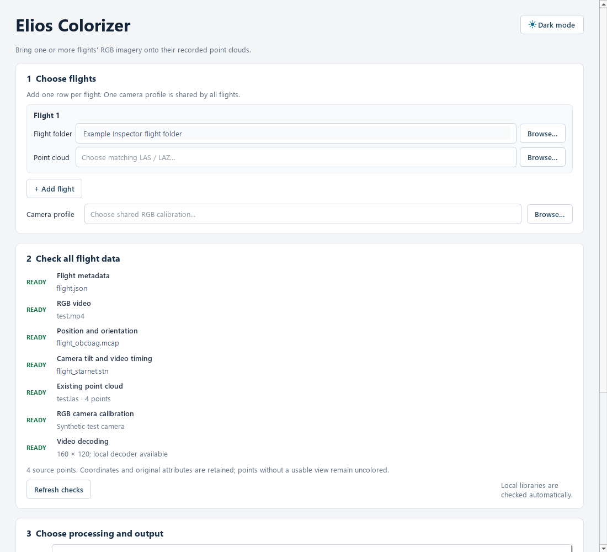

<p align="center">
  
</p>

<h1 align="center">Elios Colorizer</h1>

<p align="center">
  Local Windows software for projecting synchronized Elios 3 RGB video onto
  Inspector LAS point clouds.
</p>

<p align="center">
  <a href="https://github.com/echerrman/Elios-Colorizer/actions/workflows/ci.yml?query=branch%3Amain"></a>
  <a href="https://github.com/echerrman/Elios-Colorizer/releases/tag/v1.3.0"></a>
  <a href="LICENSE"></a>
  
  
</p>

<p align="center">
  <a href="https://github.com/echerrman/Elios-Colorizer/releases/latest"><strong>Download for Windows</strong></a>
  ·
  <a href="docs/INSTALLATION.md">Installation</a>
  ·
  <a href="docs/USER_GUIDE.md">User guide</a>
  ·
  <a href="https://github.com/echerrman/Elios-Colorizer/issues">Report a problem</a>
</p>



Elios Colorizer creates a new RGB LAS from an existing Inspector point cloud,
native flight telemetry, and recorded 4K video. It preserves unobserved geometry,
marks every point with an explicit colorization status, and performs all work on
the local computer. Flight data is not uploaded to a cloud service.

> **Version 1.3:** advanced controls for RGB sampling frequency, image-edge
> exclusion, and blur rejection complement single-flight and multi-flight
> colorization, illumination balancing, and NVIDIA CUDA acceleration.

## Install

1. Download the Windows x64 portable ZIP from the
   [latest release](https://github.com/echerrman/Elios-Colorizer/releases/latest).
2. Extract the complete ZIP.
3. Run `EliosColorizer.exe` inside the extracted `EliosColorizer` folder.

The portable build includes its runtime and libraries. Users do not need Python,
ROS, a Flyability cloud account, or a separate FFmpeg installation. Keep the
bundled `_internal` directory beside the executable. See the
[installation guide](docs/INSTALLATION.md) for updating and source builds.

## Required inputs

| Input | Purpose |
| --- | --- |
| Native Inspector flight folder | RGB segments, pose telemetry, camera state, and recorded frame timing |
| Matching Inspector LAS or LAZ | Reliable source geometry and original point attributes |
| Measured RGB camera profile | Lens, camera mount, and camera-head tilt calibration |

Navigation-camera calibration files do not describe the 4K recording camera. A
profile marked as validated must be backed by measured calibration and independent
reprojection checks. Read the [camera calibration guide](docs/CALIBRATION.md).

## Workflows

| Workflow | Result |
| --- | --- |
| Single flight | One geometry-preserving colorized LAS |
| Multiple flights, separate | One independent colorized LAS per flight |
| Multiple flights, merged | Confidence-aware colorization of one aligned merged LAS |

Merged output supports a user-aligned cloud with per-flight transforms or an
automatic alignment workflow. Automatic alignment accepts corrections only when
overlap improves within strict movement and quality limits; a failed alignment
stops the run and directs the user to align manually. Merging works best when
Inspector has already placed every cloud in a common coordinate system.

An optional distance limit prevents distant background points from receiving
low-confidence RGB. Uncolored points are retained in every workflow so the user
can inspect or filter them later.

[Read the workflow guide →](docs/USER_GUIDE.md)

## How colorization works

The application maps decoded frames to recorded StarNet `VideoFrameSync`
timestamps instead of assuming that video and MCAP files start together. It
interpolates body pose and camera pitch on the flight clock, projects visible LAS
points into sampled video frames, rejects poor observations, and keeps the
highest-confidence usable color for each point.

Visibility uses a point-cloud depth buffer. Observation quality considers image
position, distance, sharpness, and exposure. On a compatible NVIDIA GPU, CUDA
performs projection, depth-buffer visibility, RGB sampling, illumination
correction, and observation scoring in bounded batches. The application falls
back automatically to the CPU implementation and independently chooses between
an in-memory coordinate cache and a bounded-memory streaming path.

[Read the synchronization design →](docs/TIME_SYNCHRONIZATION.md)

## Output

RGB uses the LAS 16-bit color range. Single and separate outputs retain source
coordinates and compatible attributes. The application adds:

| Attribute | Meaning |
| --- | --- |
| `Colorized` | `1` if a usable RGB observation was selected; otherwise `0` |
| `ColorConfidence` (separate outputs only) | Relative score of the selected observation |
| `ColorDistance` (separate outputs only) | Camera-to-point distance in metres |
| `SourceFlight` | One-based source-flight index in merged output |

Each output includes a JSON processing report with calibration identity, timing
checks, warnings, processing configuration, and coverage statistics.

[Read the output specification →](docs/OUTPUT_FORMAT.md)

## Privacy and safety

- Flight data is processed locally and is never modified in place.
- Existing output files are not overwritten.
- Missing or inconsistent timing, pose, video, or calibration data stops the run
  instead of being silently guessed.
- Diagnostic reports can contain local paths and flight metadata. Sanitize them
  before sharing publicly.
- Do not upload customer footage, facility names, locations, or proprietary
  Inspector data to GitHub issues.

Security concerns should be reported privately according to
[SECURITY.md](SECURITY.md).

## Compatibility and limitations

- Windows 10 or 11, 64-bit.
- NVIDIA CUDA acceleration supports NVIDIA GPUs with compute capability 7.5 or
  newer and a current driver; the CPU fallback remains available on other
  systems.
- Observed Inspector native layout with StarNet Camera schema version 4.
- LAS output; LAS and LAZ input.
- Point-cloud visibility is approximate around thin or sparse structures.
- Moving objects, rolling shutter, lighting changes, and calibration error can
  create seams or misplaced color.
- E57 and waveform LAS are not currently supported.

See the [changelog](CHANGELOG.md) for release history.

## Development

The complete source, tests, and reproducible Windows build scripts are public.
Use 64-bit Python 3.12. CUDA-enabled development builds also require the
NVIDIA CUDA Toolkit and the Visual Studio 2022 **Desktop development with
C++** workload; builds without them retain the CPU fallback:

```powershell
./scripts/setup.ps1
& ./.venv/Scripts/python.exe -m pytest
./scripts/build.ps1
```

The packaged application provides a deterministic synthetic integration check:

```powershell
./dist/EliosColorizer/EliosColorizer.exe --self-test ./selftest-output
./dist/EliosColorizer/EliosColorizer.exe --cuda-check ./cuda-checkpoint
```

Contributions are welcome through the process in
[CONTRIBUTING.md](CONTRIBUTING.md). Dependency licenses and notices are listed in
[THIRD_PARTY_NOTICES.md](THIRD_PARTY_NOTICES.md).

## License and attribution

Elios Colorizer is available under the [MIT License](LICENSE).

Elios, Elios 3, Inspector, and Flyability are trademarks of their respective
owners. This independent open-source project is not affiliated with, sponsored
by, or endorsed by Flyability.

### v1.3.0

Version 1.3.0 adds an **Advanced Processing Settings** window with adjustable
RGB sampling up to the Elios 3 recording rate of 30 fps, image-edge exclusion,
and blur rejection. Each control can be reset independently, and processing
reports now begin with a concise user-focused summary.

### v1.2.0

Version 1.2.0 adds bounded NVIDIA CUDA acceleration for the most expensive
projection, visibility, sampling, correction, and scoring work. Runtime checks
select CUDA when supported and safely retain the complete CPU processing path.

### v1.1.0

The optional **Illumination Balancing** control uses matched geometry to
reduce radial lighting differences conservatively. See
[Illumination Balancing](docs/ILLUMINATION_BALANCING.md) for validation, fallback,
and synthetic performance measurements. Version 1.1.0 also applies adaptive
resource tuning and indexing to all processing workflows.
